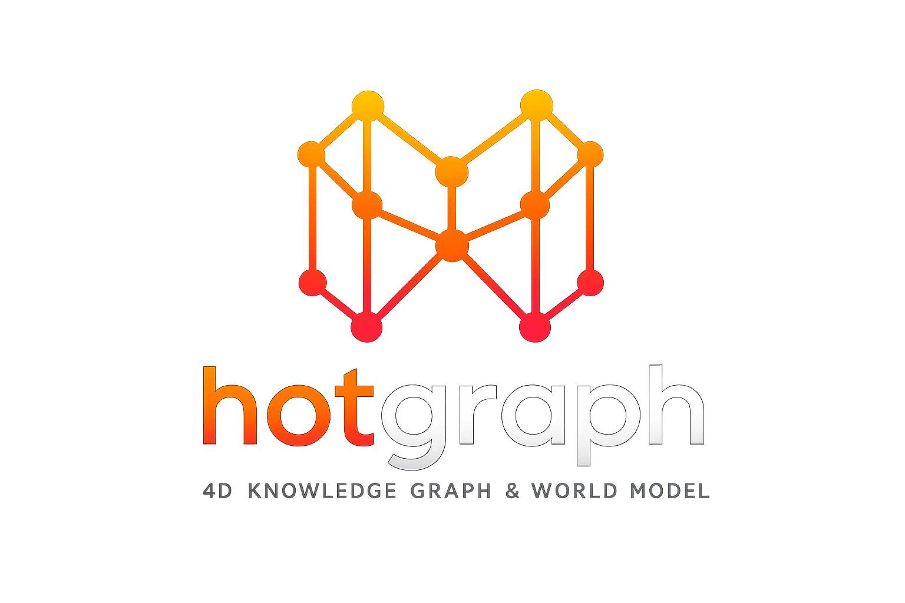

<p align="center">
  
</p>

# Hotgraph

**Reality Graph: 4D Knowledge Graph - Rust**

Hotgraph is an open-source Rust project exploring a bitemporal, evidence-backed graph kernel for AI memory and world-state reasoning.

The practical goal is narrow:

```text
source-backed assertions
  -> append-only events
  -> bitemporal graph state
  -> belief/conflict/dependency tracking
  -> evidence-backed API/query responses
```

The project is **pre-alpha**. It is not a production database, not a stable public API, not a distributed graph engine, and not an optimized storage engine. The current engineering bar is to prove the kernel, event log, single-node storage, and API semantics before claiming scale.

## What Is Real Today

Hotgraph stores assertions about reality, not naive facts.

```text
Entity:      a thing that may exist
Assertion:  a claim about reality
Source:     evidence supporting an assertion
Event:      something the system or world recorded
Atom:       the Reality Kernel primitive for claims, memories, events, summaries,
            simulations, and derived beliefs
State:      resolved graph view at valid time + transaction time
```

Every meaningful assertion/atom is expected to carry:

- valid time: when it is true in the modeled world
- transaction time: when the system learned, stored, revised, or rejected it
- provenance: sources and evidence spans
- confidence and belief state
- context, tenant, permission, and taint metadata where applicable
- contradiction and dependency links when applicable

See [AGENTS.md](AGENTS.md) for the non-negotiable engineering rules.

## Implemented Vs Planned

This table is the fastest way to understand the repo without reading the roadmap as a claim.

| Area | Status | Notes |
| --- | --- | --- |
| Reality Kernel atoms | Implemented, tested | `rg-kernel` includes atoms, bitemporal visibility, belief states, provenance, conflicts, dependencies, truth-maintenance primitives, causal primitives, and a minimal query VM. |
| Core graph domain | Implemented, tested | `rg-core` defines IDs, entities, assertions, sources, intervals, confidence, context, ontology validation, and agent memory primitives. |
| Event-sourced writes | Implemented, tested | `rg-events` validates commands, appends deterministic events, and can replay graph state. |
| Single-node storage | Prototype, tested | `rg-storage` has in-memory storage, file logs, redb-backed state, snapshots, backups, and recovery contracts. It is not yet a proven production database. |
| Temporal/adjoining indexes | Prototype, tested | `rg-index` supports point-in-time lookups and contradiction checks with simple structures. |
| Query engine | Prototype, tested | `rg-query` supports internal graph/path queries over storage/index layers. Planner, cancellation, and large-result serving are still maturing. |
| HTTP API | Prototype, tested | `rg-api` exposes entities, assertions, sources, queries, paths, evidence packs, health, metrics, auth, and governance hooks. Public API stability is not promised. |
| AI context/evidence packs | Prototype, tested | Evidence-pack generation exists. Deterministic AI providers are explicitly fixture-only and not production model integrations. |
| Governance/security | Prototype, tested | Tenant/source/memory policies, redaction, audit, capability, and taint primitives exist. Full production enforcement still requires external review. |
| Confidential/KMS | Prototype, tested | AEAD envelope encryption and an AWS KMS feature-gated adapter exist. Production use still needs real IAM/KMS deployment proof. |
| Multi-replica runtime | Prototype | Single-writer/follower primitives, replication batches, and write proxy tests exist. No production failover evidence yet. |
| Benchmarks at 10M/50M/100M | Planned evidence gate | Artifact schemas and gates exist. Real benchmark artifacts are not yet published. |
| Pen test / restore drill / dirty-data pilot | Planned evidence gate | Templates exist. A production claim is blocked until real dated evidence exists. |
| GraphRAG, worldgen, gyms, frontier evals, trillion-edge roadmap | Experimental / research | These live in labs and docs. They are not the production surface. |

## Core Workspace Surface

These are the crates reviewers should judge first.

| Crate | Purpose |
| --- | --- |
| `rg-core` | Assertion-first domain primitives and ontology validation. |
| `rg-kernel` | Reality Atom, bitemporal visibility, belief state, provenance, conflicts, dependencies, truth maintenance, causal primitives, and query VM. |
| `rg-events` | Event-sourced command validation, deterministic events, monotonic transaction time, and replay. |
| `rg-storage` | Single-node storage, WAL/snapshot/backup/recovery primitives, redb-backed serving state, and replication contracts. |
| `rg-index` | Temporal and adjacency indexes plus contradiction checks. |
| `rg-query` | Internal graph and path query execution. |
| `rg-api` | Axum HTTP API boundary, auth, governance hooks, metrics, and evidence/query endpoints. |

The rest of the workspace is useful, but should be read as experimental labs until the core has hard benchmark and operations evidence.

## Experimental Labs

These crates exist to test product directions, not to imply those systems are production-ready:

- AI retrieval and context: `rg-ai`, `rg-retrieval-compiler`, `rg-memory-activation`, `rg-context-compression`, `rg-context-serving`, `rg-cognitive-cache`
- Belief/time/causality: `rg-belief`, `rg-truth-maintenance`, `rg-temporal-reasoning`, `rg-causal`, `rg-sim`, `rg-agent-sim`
- Ingestion/trust/maintenance: `rg-ingest`, `rg-ingest-multimodal`, `rg-maintenance`, `rg-source-trust`, `rg-active-knowledge`, `rg-ontology-learning`
- Agent/security/integration: `rg-agent-memory`, `rg-agent-security`, `rg-governance`, `rg-confidential`, `rg-mcp-server`, `rg-integrations`, `rg-reality-api`
- Evaluation/research/training: `rg-eval`, `rg-frontier-eval`, `rg-memory-turing-test`, `rg-adversarial-memory-eval`, `rg-agent-judge`, `rg-learning`, `rg-feedback-loop`, `rg-training-data`, `rg-worldgen`, `reality-gym`
- Deployment/scale research: `rg-lab-deploy`, `rg-federation`, `rg-multi-agent`, `rg-graphrag`, `rg-runtime`, `rg-distillation`, `rg-accelerated`, `rg-bench`

If a crate is not in the core surface above, assume it is a prototype unless a release record says otherwise.

## Repository Layout

```text
reality-graph/
  crates/
    rg-core/
    rg-kernel/
    rg-events/
    rg-storage/
    rg-index/
    rg-query/
    rg-api/
    ...experimental labs...
  docs/core/              kernel semantics and invariants
  docs/architecture/      architecture docs and roadmaps
  docs/ops/               production gates, runbooks, drills, benchmark templates
  docs/product/           PRD and product notes
  docs/security/          threat model, KMS/governance notes, pen-test template
  infra/docker/           local Docker stack
  infra/k8s/              Kubernetes manifests and overlays
  python/reality_graph/   thin HTTP SDK prototype
  frontend/               admin/lab console prototypes
  schemas/                OpenAPI and protobuf drafts
  specs/rmp/              Reality Memory Protocol draft
```

## Architecture Sketch

```text
Sources
  -> reviewed commands
  -> append-only events
  -> materialized assertions and Reality Atoms
  -> temporal indexes and dependency/conflict views
  -> graph/query/evidence APIs
  -> AI context packs with provenance
```

Hotgraph separates truth from retrieval:

- The graph decides what evidence exists.
- Indexes make evidence discoverable.
- Vector search, when used, proposes candidates only.
- LLMs summarize evidence; they do not become source-of-truth.
- Belief, contradiction, permission, and temporal semantics stay in Rust.

## Development

Install Rust with `rustup`, then run:

```bash
cargo fmt --all --check
cargo clippy --all-targets --all-features -- -D warnings
cargo test --all
cargo test --all --release
```

Run focused kernel tests:

```bash
cargo test -p rg-kernel --test reality_kernel
```

Run the API locally:

```bash
cargo run -p rg-api
```

Health and metrics:

```text
GET http://127.0.0.1:8080/v1/health
GET http://127.0.0.1:8080/v1/metrics
```

## Local Deployment

Docker Compose is for local development:

```bash
docker compose -f infra/docker/docker-compose.yml up --build
```

Kubernetes manifests and overlays are under `infra/k8s/` and `infra/k8s-overlays/`.

```bash
kubectl apply -k infra/k8s-overlays/dev
```

Do not treat these manifests as production evidence by themselves. Production readiness requires release records, benchmark artifacts, restore drills, security review, and dirty/adversarial pilot results.

## Production Gate

Hotgraph cannot claim production-grade status until a release record under `docs/ops/releases/` links dated evidence for:

- crash/recovery matrix
- backup and restore drill with RPO/RTO
- real KMS deployment
- governance and cross-tenant leakage tests
- 10M/50M/100M benchmark artifacts
- penetration test with no open critical/high findings
- dirty/adversarial data pilot postmortem
- on-call drill using runbooks

The templates exist so the project can earn those claims rather than imply them.

## Documentation Map

- [Product PRD](docs/product/prd.md)
- [Reality Atom](docs/core/reality-atom.md)
- [Core invariants](docs/core/core-invariants.md)
- [Bitemporal semantics](docs/core/bitemporal-semantics.md)
- [Belief semantics](docs/core/belief-semantics.md)
- [Truth maintenance](docs/core/truth-maintenance.md)
- [Query VM](docs/core/query-vm.md)
- [Production readiness status](docs/ops/production-readiness-status.md)
- [Threat model](docs/security/threat-model.md)
- [KMS and governance](docs/security/kms-governance.md)

Architecture decisions:

- [ADR 0001: Rust core](docs/adr/0001-rust-core.md)
- [ADR 0002: Event sourcing](docs/adr/0002-event-sourcing.md)
- [ADR 0003: Bitemporal model](docs/adr/0003-bitemporal-model.md)

## License

This workspace is open source under `MIT OR Apache-2.0`.

See [LICENSE-MIT](LICENSE-MIT) and [LICENSE-APACHE](LICENSE-APACHE).
