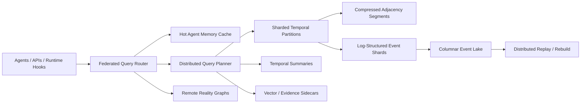

# Trillion-Edge Architecture Roadmap

## Status

Research roadmap only. Do not implement this architecture until the single-node engine has benchmark evidence, correctness tests, and operational experience that justify each layer of complexity.

## Purpose

Reality Graph must have a credible path from a correct single-node 4D temporal knowledge graph to a lab-scale substrate for persistent AI memory, historical replay, and federated reality modeling.

Target future scale:

- 1 trillion assertions.
- 100 billion events.
- Millions of agents with private, team, and organization memory.
- Sub-second hot recall for active agent workloads.
- Distributed historical replay.
- Global graph federation across trust boundaries.

At this scale, an edge is a derived serving relationship from source-backed assertions. The event log and bitemporal assertion model remain the source of truth.

## Non-Negotiable Invariants

- Rust core semantics remain authoritative.
- Writes append events before indexes update.
- Assertions remain bitemporal with valid time and transaction time.
- Every assertion and derived edge remains source-backed.
- Serving indexes, vector indexes, caches, and summaries remain derived projections.
- Query output includes provenance, source IDs, and temporal coordinates.
- Deterministic replay must be possible within each partition and across a versioned federation boundary.
- Agent memory can be cached, summarized, and replicated, but revision history must not be erased.

## Scale Model

The system should scale along four axes:

- Event volume: append, compact, export, and replay 100B events.
- Assertion volume: serve and analyze 1T bitemporal assertions.
- Agent concurrency: support millions of working sets without cross-tenant leakage.
- Federation breadth: route queries across local, team, enterprise, lab, partner, and public graphs.

The target is not to make every query touch trillion-edge global state. The target is to route most requests to small hot working sets, bounded temporal partitions, and source-backed summaries, while still allowing deeper historical or federated replay when needed.

## Logical Architecture



## Log-Structured Graph Storage

The durable write path should remain append-only:

1. Accept validated commands at an ownership shard.
2. Append events to a partition-local log with deterministic event IDs and monotonic transaction time.
3. Materialize hot indexes from committed log segments.
4. Seal immutable segments for compaction, snapshots, replay, and export.
5. Rebuild damaged projections from logs and snapshots.

Future log storage should use:

- Immutable event segments with content hashes.
- Partition-local transaction clocks plus globally comparable epoch metadata.
- Segment manifests that record schema version, ontology version, tenant/context, time range, and hash chain.
- Compacted snapshots for fast restart.
- Replay cursors for index rebuild and federation sync.

The event log is optimized for correctness and replay. Query serving uses derived stores.

## Sharded Temporal Partitions

Partitioning should be multidimensional:

- Tenant or trust boundary first.
- Context/world namespace second.
- Entity partition for hot serving.
- Valid-time segment for historical graph state.
- Transaction-time segment for replay and "what did we know then" questions.

Recommended partition key:

```text
tenant_id / context_id / entity_partition / valid_time_bucket / tx_epoch
```

This avoids a single global shard map becoming the product's hidden bottleneck. Entity-heavy workloads route by entity partition. Historical reconstruction routes by valid-time and transaction-time ranges. Agent-memory workloads route by agent, team, and active entity working set.

## Compressed Adjacency

Hot graph traversal should use compressed adjacency segments, not row-by-row assertion scans.

Initial layout:

- Entity ID dictionary with stable integer ordinals.
- Predicate ID dictionary with compact typed predicate IDs.
- CSR-like adjacency arrays per shard.
- Delta segments for recent writes.
- Roaring bitmap candidate sets for predicate, context, confidence, and temporal filters.
- Sorted assertion ID arrays for deterministic traversal.

Read path:

1. Resolve entity and predicate IDs.
2. Load hot adjacency segment and recent delta.
3. Apply temporal and permission bitmaps.
4. Join back to assertion metadata and source IDs only for surviving candidates.

This keeps common path and neighbor queries cache-friendly while preserving bitemporal correctness.

## Columnar Event Lake

The event lake is for historical analysis, replay verification, offline eval, training data, and large scans. It is not the hot serving path.

Columnar layout should include:

- Event records partitioned by tenant, tx epoch, event type, and schema version.
- Assertion columns for subject, predicate, object, valid interval, confidence, context, status, and source IDs.
- Source and evidence metadata columns.
- Agent-memory event columns.
- Causal event/link columns.
- Hash and signature columns for auditability.

The event lake should support:

- Replay comparison against serving indexes.
- Offline contradiction and ontology-drift jobs.
- Frontier eval dataset generation.
- Training-data export.
- Historical audits and legal hold.

## Distributed Query Execution

Distributed query planning must remain evidence-first and temporal-first.

Planner inputs:

- Query intent and retrieval plan.
- Valid-time and known-at constraints.
- Tenant, permission, and source policy.
- Entity anchors and candidate predicates.
- Latency and cost budget.
- Federation policy.

Planner stages:

1. Route to hot cache when the request fits an agent working set.
2. Route to entity partitions for anchored relationship queries.
3. Route to temporal partitions for historical reconstruction.
4. Route to summaries for broad/global questions.
5. Fan out across federated graphs only when policy allows.
6. Merge results with deterministic ordering, provenance, and contradiction metadata.

The planner should return an explain trace that names partitions, filters, remote graphs, summaries, and cache hits.

## Tiered Storage

Reality Graph should separate write durability, hot serving, analytical history, and cold archive.

| Tier | Purpose | Data |
| --- | --- | --- |
| L0 | Active writes | mutable delta indexes, recent event segment |
| L1 | Hot serving | memory-mapped adjacency, temporal bitmaps, evidence metadata |
| L2 | Warm history | compacted snapshots, sealed segments, summary indexes |
| L3 | Analytical lake | columnar event/assertion/source data |
| L4 | Cold archive | encrypted source payloads, old logs, legal-hold bundles |

Promotion and demotion should be driven by access frequency, active agents, open tasks, legal policy, and temporal recency.

## Hot/Cold Memory Layout

Agent memory needs a separate hot layout because agent recall is dominated by working sets, not global scans.

Hot memory:

- Agent working set.
- User or team working set.
- Current task context.
- Recently reinforced memories.
- Active goals, plans, preferences, and corrections.
- Source IDs and citation-ready snippets.

Cold memory:

- Archived episodic memories.
- Superseded beliefs.
- Old tool traces.
- Low-trust or stale observations.
- Full source payloads.

Memory cache entries must include:

- Permission-aware cache key.
- Valid-time and transaction-time bounds.
- Source trust and taint labels.
- Contradiction and supersession version.
- Summary staleness epoch.

Cache invalidation must be temporal, permission-aware, contradiction-aware, and source-aware.

## Local Agent Memory Caches

Millions of agents cannot all hit the global graph for every turn. Each active agent should have a bounded local cache:

- Hot entities.
- Recent evidence packs.
- Current belief state.
- Active goals and plans.
- Task-specific compressed context.
- Retrieval traces for repeated tool-choice decisions.

Local caches should be populated by the retrieval compiler and invalidated by:

- New events affecting active entities.
- Belief revisions.
- Source redaction or permission changes.
- Contradiction discovery.
- Summary invalidation.
- Agent handoff or tenant boundary changes.

The local cache is a model-runtime acceleration layer, not a source of truth.

## Federated Graph Routing

Global graph federation should treat every graph as a trust boundary.

Federation metadata:

- Graph node ID.
- Tenant or organization boundary.
- Supported schema and RMP versions.
- Trust score and attestation status.
- Permission policy.
- Available indexes.
- Latency and cost profile.
- Source boundary labels.

Federated query flow:

1. Plan local retrieval first.
2. Identify missing facts, remote entity anchors, or cross-boundary joins.
3. Check federation policy and permissions.
4. Fan out compact subqueries to permitted graph nodes.
5. Merge partial evidence packs with boundary labels.
6. Preserve remote source provenance and trust score.
7. Return partial-result warnings when remote graphs are unavailable.

Federation should prefer source-backed partial answers over opaque global consistency claims.

## Distributed Historical Replay

Historical replay has two modes:

- Partition replay: rebuild one shard from its event log and snapshots.
- Coordinated replay: reconstruct a multi-partition view at a global transaction epoch.

Coordinated replay requires:

- Versioned schema registry.
- Partition manifests.
- Global epoch map.
- Deterministic merge order.
- Cross-partition entity-resolution snapshots.
- Replay audit report.

Replay should be used for correctness verification, disaster recovery, eval reproducibility, and index repair. Hot serving should not depend on replay for every request.

## Roadmap

### Stage 0: Single-Node Proof

- Prove the Rust core, bitemporal semantics, event sourcing, and deterministic replay.
- Hit single-node benchmark targets before adding distributed complexity.
- Keep all new scale work as docs, benchmarks, and isolated research crates.

### Stage 1: Local Segment Architecture

- Add immutable event and adjacency segment formats.
- Add local partition metadata without remote execution.
- Add memory-mapped snapshots and deterministic segment replay tests.
- Benchmark compressed adjacency and temporal bitmap candidates.

### Stage 2: Columnar History and Offline Replay

- Export event and assertion segments to the columnar lake.
- Compare serving indexes against lake replay outputs.
- Add historical evals for temporal correctness and belief revision.
- Add offline training-data generation from replayed worlds.

### Stage 3: Hot Agent Memory Plane

- Add permission-aware local agent working sets.
- Add cache invalidation by temporal, contradiction, source, and belief epochs.
- Target sub-second hot recall before global distributed fanout.
- Measure p95 hot recall and evidence-pack latency under multi-agent load.

### Stage 4: Distributed Query Planning

- Add a query planner that can route to local partitions.
- Add deterministic merge and explain traces.
- Add query cost estimates and fanout limits.
- Keep writes single-owner per partition.

### Stage 5: Federated Graphs

- Add remote graph metadata, routing policy, and boundary labels.
- Support permissioned cross-graph evidence packs.
- Add partial-result semantics and trust scoring.
- Test federation with synthetic worldgen and frontier eval fixtures.

### Stage 6: Lab-Scale Operations

- Add reproducible replay bundles for papers.
- Add online index rebuilds and rolling segment compaction.
- Add disaster-recovery drills across partitions.
- Add long-term support profiles for frozen research deployments.

## Validation Gates

Do not advance stages without benchmark and correctness evidence.

Required gates:

- Replay equivalence between event logs, snapshots, and serving indexes.
- Bitemporal query correctness under partition splits.
- No cross-tenant or cross-agent leakage under cache and federation tests.
- p95 hot agent recall under 30ms for cached working sets.
- p95 hot entity state under 20ms for cached graph state.
- p95 common evidence pack under 300ms when cached.
- Partition fanout explain traces for every distributed query.
- Recovery drill showing failed index updates can be repaired by replay.

## Risks

- Premature distribution can hide semantic bugs behind infrastructure.
- Global transaction ordering can become a scalability trap.
- Cache invalidation can leak stale, contradicted, or unauthorized memory.
- Summaries can become covert retention of redacted sources.
- Federation can blur trust boundaries if boundary labels are optional.
- Columnar lake outputs can diverge from serving semantics if replay is not continuously tested.

## Design Principle

The trillion-edge version should feel like the same Reality Graph: source-backed assertions, bitemporal truth, deterministic replay, evidence-first AI context, and explicit uncertainty. Scale is allowed to add partitions, segments, caches, lakes, and federated routing. It is not allowed to weaken what the graph means.
